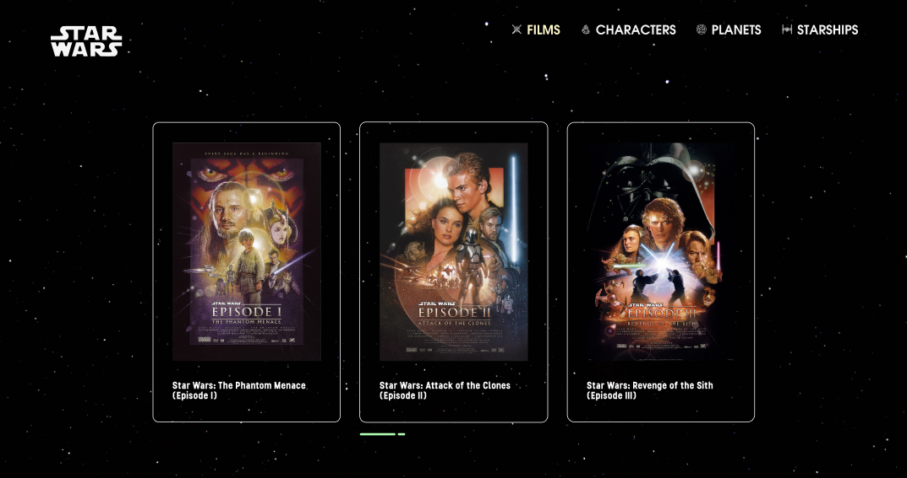

# Star Wars Explorer

> A single-page application for exploring the Star Wars universe — films, characters, planets, and starships. Features collectible 3D cards, animated lightsabers, and original stylized artwork.


## 🔗 Live Demo

**[star-wars-explorer.vercel.app](https://star-wars-explorer.vercel.app)**

## 📸 Preview



## 💡 About the Project

Star Wars Explorer is an interactive single-page app that lets users browse films, characters, planets, and starships from the Star Wars universe. Detail cards open as modal overlays over the home page, preserving scroll and cached data. Mobile users navigate with swipe gestures; desktop users get 3D card rotation that responds to mouse movement.

I built this project to go beyond a typical CRUD app — to design an experience with personality. The UI layout, collectible card artwork, and all stylized character photos are original work. The technical side focuses on performance (in-memory cache, parallel fetches), smooth animations (Framer Motion + CSS keyframes), and a custom breakpoint system that adapts layouts across 8 device sizes.

## ✨ Features

- **Modal overlay architecture** — detail views open over the home page, preserving scroll position and cached data
- **Shareable URLs** — every entity accessible via search params (`?type=character&id=10`)
- **In-memory API cache** — each entity fetched once per session; reopening cards is instant
- **Swipe navigation** — touch gestures on mobile for both section pagination and modal card switching
- **3D card rotation** — collectible character cards respond to mouse movement on desktop
- **Animated lightsabers** — color-coded SVG lightsabers with CSS clip-path ignite animation
- **Responsive design** — 8 device breakpoints with centralized layout config
- **Original artwork** — custom UI, hand-stylized character photos, collectible card designs

## 🛠 Tech Stack

**Frontend**
- React 19
- TypeScript (strict mode)
- Tailwind CSS 3
- Redux Toolkit (state management)
- React Router DOM 7 (search params routing)
- Framer Motion (animations)
- Axios (with in-memory cache layer)

**Build & Tooling**
- Vite 7
- ESLint 9
- Custom fonts (ITC Avant Garde, Stellar)

**API**
- [SWAPI](https://swapi.dev) — open Star Wars API, no key required

## 🎯 Technical Highlights

- **Modal overlay routing** — single route `/` with search params for detail views. Home view stays mounted, overlays render on top. Users can share direct links to specific characters or planets.

- **Responsive system** — `useBreakpoint` hook detects 8 device types by window width. A centralized `RESPONSIVE_CONFIG` maps each device to grid columns, gaps, card sizes, and items per page. Components use a proxy pattern to render desktop or mobile variants.

- **API caching layer** — service functions wrap Axios calls with in-memory cache. `Promise.all` batches parallel requests on section load. Cache persists across route changes for instant back-navigation.

- **3D card rotation** — `useCardRotation` hook tracks mouse position relative to the card and applies `rotateX`/`rotateY` transforms with perspective, creating a tactile collectible-card feel.

- **Redux Toolkit for global state** — manages entity collections and UI state across modal transitions, keeping component trees shallow.

## 📁 Project Structure
src/
├── components/
│   ├── desktop/         # Desktop-specific cards and modals
│   ├── mobile/          # Mobile-specific cards and modals
│   └── overlays/        # Film, Character, Planet, Starship overlays
├── config/              # Responsive layout configuration
├── constants/           # Image mappings, display settings, entity IDs
├── hooks/               # useBreakpoint, useCharacters, useCardRotation, etc.
├── pages/               # Home, DetailOverlay, NotFound
├── sections/            # Home page sections (desktop/mobile variants)
├── services/            # API layer with caching (swapi.ts)
└── types/               # TypeScript interfaces

## 🚀 Run Locally

```bash
# Clone the repo
git clone https://github.com/ayanbaryshev02-dev/star-wars-explorer.git
cd star-wars-explorer

# Install dependencies
npm install

# Start dev server
npm run dev
```

Open [http://localhost:5173](http://localhost:5173) in your browser.

### Available Scripts

| Command | Description |
|---------|-------------|
| `npm run dev` | Start dev server |
| `npm run build` | Type-check + production build |
| `npm run preview` | Preview production build |
| `npm run lint` | Run ESLint |

## 📚 What I Learned

- **Modal-as-route** patterns are tricky but powerful — search params let you make modals shareable without breaking back-button behavior.
- **Centralized responsive config** beats scattered breakpoint classes when you need pixel-perfect layouts across many device sizes.
- **In-memory caching** dramatically improves perceived performance — especially when users navigate back and forth between detail views.
- **Framer Motion + CSS keyframes** can coexist — each has its strengths (orchestrated sequences vs. looping accents).
- **Design is engineering** — creating original artwork and stylizing photos made me think about UX in ways coding alone wouldn't.

## 👤 Author

**Ayan Baryshev** — design, stylized artwork, and development.

- GitHub: [@ayanbaryshev02-dev](https://github.com/ayanbaryshev02-dev)
- LinkedIn: [ayan-baryshev](https://www.linkedin.com/in/ayan-baryshev-4a38a2366/)
- Telegram: [@Ayanbaryshev](https://t.me/Ayanbaryshev)
- Email: ayanbaryshev02@gmail.com